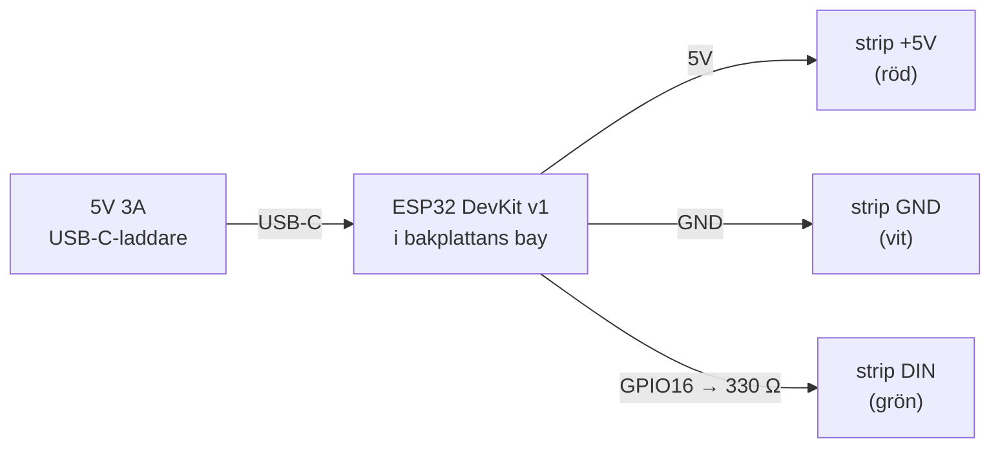

# Koppling — svensk ordklocka

Praktisk kopplingsplan från oklippt stripprulle till färdig klocka på väggen.
Läs [`README.md`](README.md) för mått och printning, den här filen för elen.

> **Allt som står "vänster" och "höger" i den här filen är sett FRAMIFRÅN**, med
> klockan rättvänd. Bakplattans **stripsida vänder framåt** mot bokstäverna, så
> när du lödar strippen ser du samma bild som någon framför klockan — ingen
> spegling. Först när du vänder plattan för att montera ESP32:n kastas vänster
> och höger om.
>
> Enda entydiga referensen när plattan ligger lös: **USB-C-öppningen i ramen
> sitter i klockans underkant.** Hittar du den vet du var nedan är.

> **Skalet har elva radplatser, men bara tio bär strip.** Den tomma sitter
> **överst**, ovanför KLOCKAN ÄR. Räkna därför aldrig fysiska rader uppifrån —
> utgå från bokstäverna, annars ligger du konsekvent ett steg fel.

---

## Status: vad som redan är gjort

ESP32:n är flashad och konfigurerad. Du behöver inte röra firmware för att koppla.

| | |
|---|---|
| Kort | ESP32-D0WD-V3 rev 3.1, 4 MB flash, MAC `d4:e9:f4:b2:74:20` |
| Firmware | WLED 16.0.1 "Niji" |
| Adress | `192.168.30.17` · `http://ordklocka.local` (fast IP satt i UniFi) |
| Namn | `Ordklockan` |
| LEDs | 110 st, typ WS281x, **GPIO16** |
| Matris | 11 × 10, serpentin, första LED **nere till vänster** |
| Strömgräns | 2000 mA |

Firmware uppdateras härifrån **över OTA** — klockan behöver aldrig mer kopplas
till USB för flashning.

---

## Kopplingsschema



### Strippens tre kablar → ESP32

**Färgen på pigtailen säger vad kabeln är. Texten på kortet säger vart den ska.**

| Strippens kabel | Signal | ESP32-stift | Står på kortet som |
|---|---|---|---|
| **Röd** | `+5V` | `VIN` | `VIN`, ibland `5V` |
| **Vit** | `GND` | `GND` | ta den **bredvid `VIN`** |
| **Grön** | `DIN` | GPIO16 | **`RX2`**, `D16` eller `16` — alla är samma stift |

Håll kortet med **USB-kontakten nedåt** och komponentsidan mot dig:

- **`VIN`** — nedersta stiftet i **vänstra** raden, hörnet närmast USB
- **`GND`** — direkt **ovanför** `VIN`, samma rad
- **`RX2`** — **högra** raden, **femte stiftet räknat nedifrån**

Röd och vit hamnar alltså bredvid varandra nere till vänster, grön ensam på
andra sidan kortet.

> ⚠️ **Kolla att röd sitter på `VIN` och inte på `RX2` innan du sätter i USB:n.**
> Det är den enda felkopplingen i hela bygget som kan skada kortet — 5 V rakt in
> i en 3,3 V-pinne. Att röd och grön hamnar på var sin sida av kortet är just
> för att göra förväxlingen svår.

Osäker på ditt kort? Mät `VIN` mot `GND` med USB i, ratten på `V⎓`: **4,6–5,0 V**
förväntat. Läser den 0 matar inte det kortet 5 V utåt, och strippens röda får tas
direkt från USB-källan istället.

`GPIO16` är silkscreen-märkt `RX2` på de flesta DevKit v1 — det ser ut som en
seriell port men är rätt stift. Det är satt i WLED under *Config → LED
Preferences*.

### Strippens kabelgrupper

Strippen har två kabelgrupper i samma ände och de sitter parallellt på samma tre
lödöar: en 3-grupp (röd/grön/vit = 5V/DIN/GND) och ett lösare par (röd/vit =
5V/GND för strömmatning). **De 3 är inte RGB** — WS2812B är adresserbar och
styrs av en enda dataledare.

### Verifiera innan du lödar

1. Titta på silkscreen där kablarna sitter: öarna är märkta `+5V`, `DIN`/`DO`, `GND`
2. Kolla pilarna på strippen — **ingångsänden är den pilarna pekar bort ifrån**
3. Den änden ska bli LED 0, alltså raden vid genomföringshålet

---

## LED-ordningen

Serpentin, 10 rader à 11 LEDs. Nedan sett framifrån, rad 1 överst.

| Rad | Bokstäver | LED | Riktning | Skarv till nästa rad |
|---|---|---|---|---|
| 1 | `K L O C K A N V H Ä R` | 99 → 109 | ← höger till vänster | — (sista) |
| 2 | `S F E M I S T I O N A` | 88 → 98 | → vänster till höger | **höger** kant |
| 3 | `T J U G O M I E S N D` | 77 → 87 | ← höger till vänster | **vänster** kant |
| 4 | `K V A R T B Ö V E R G` | 66 → 76 | → vänster till höger | **höger** kant |
| 5 | `L I A H H A L V Ö T P` | 55 → 65 | ← höger till vänster | **vänster** kant |
| 6 | `E T T R T V Å L S N D` | 44 → 54 | → vänster till höger | **höger** kant |
| 7 | `T R E N F Y R A O S T` | 33 → 43 | ← höger till vänster | **vänster** kant |
| 8 | `F E M B S E X O S J U` | 22 → 32 | → vänster till höger | **höger** kant |
| 9 | `Å T T A M N I O D E K` | 11 → 21 | ← höger till vänster | **vänster** kant |
| 10 | `E L V A T O L V T I O` | **0** → 10 | → vänster till höger | **höger** kant |

**Data börjar nederst till vänster** (LED 0 = `E` i ELVA) och slutar överst till
vänster (LED 109 = `K` i KLOCKAN). Nio skarvar totalt: fem på höger kant, fyra
på vänster.

> Källa: `ledIndex()` i [`generate.js:153`](generate.js). Kommentaren på rad 150
> säger "index 0 = bottom-right" — den är ärvd från johniaks 11-radersoriginal
> och stämmer inte här. Med 10 rader blir pariteten omvänd: rad 9 är udda, så
> `index = x` och LED 0 hamnar i kolumn 0. Rad 505 har det rätt.

### Varannan rad roteras 180°

Det här är det lättaste att göra fel. Varje klippt rad har en DIN-ände och en
DOUT-ände, och pilen visar riktningen. Rader som går vänster→höger (10, 8, 6, 4,
2) läggs med pilen åt höger. Rader som går höger→vänster (9, 7, 5, 3, 1) läggs
med pilen åt vänster — alltså **roterade ett halvt varv i planet**.

Rotera i planet, vänd inte på strippen. LEDsen ska fortfarande peka framåt.

> ⚠️ **Att pilarna pekar åt olika håll är RÄTT, inte fel.** Grannrader ska alltid
> peka åt var sitt håll — det är själva serpentinen. Ser du "flera lister åt fel
> håll" är det nästan alltid det här mönstret du tittar på, och då är allt som
> det ska.

| Pilen pekar | Rader |
|---|---|
| **åt höger →** | 10, 8, 6, 4, 2 |
| **åt vänster ←** | 9, 7, 5, 3, 1 |

Ögat är ändå inte facit här. **Stapel-testet är det**: släck allt, tänd den
vänstra LEDen i varje lödd rad (`99`, `88`, `77`, `66`, `55` …) i var sin färg.
De ska bilda en lodrät linje i vänsterkanten. Hoppar en av dem över till
högerkanten ligger just den raden bakvänd — och bara den.

En rad som klarat stapel-testet är bevisad rätt oavsett hur pilen ser ut för
ögat. Löd aldrig om en verifierad rad på en känsla.


---

## Steg för steg

> **Steg 1–2 är redan gjorda** — raderna är klippta och uppklistrade. Markerings-
> banden kom ut något förskjutna i printen; raderna är utmätta och placerade för
> hand istället och sitter rätt. Nästa sak att göra är att kontrollera
> pilriktningen (se nedan) och sen löda.

### 0. Testa hela rullen INNAN du klipper

Oklippt rulle = 148 LEDs. Koppla den provisoriskt med jumperkablar (5V, GND,
GPIO16) och kör igenom den. Hittar du en död LED nu är det en reklamation —
hittar du den efter 30 lödpunkter är det ditt problem.

> ⚠️ **Max 20 % ljusstyrka.** 148 LEDs på full vit drar 8,9 A. USB:n browner ut,
> kortet bootloopar, och det ser ut som trasig hårdvara.

### 1. Klipp 10 rader à 11 LEDs

Klipp **mitt i lödöarna mellan LEDs**, aldrig inne i en LED. Klipp inte inuti en
rad — varje rad ska vara 11 obrutna LEDs.

### 2. Klistra i markeringsbanden

Ett band = en rads fotavtryck, inget mätande behövs. Börja med rad 10 (`ELVA…`)
vid genomföringshålet. Kontrollera pilriktningen mot tabellen ovan **innan** du
trycker fast — 3M-tejpen släpper ogärna snyggt.

Lägg en klick smältlim i varje radände som avlastning. Stripens egen tejp
släpper från PLA efter ett par år i värme.

### 3. Löd de nio skarvarna

Tre ledare per skarv: `5V`, `GND`, `DO → DIN`. Loopen går ut genom
**kabelslitsen** (8 × 6 mm) i den yttre kolumnväggen och ligger i sidokanalen
mellan cellgallret och ytterväggen (16,2 mm bred, 9,5 mm djup).

- 24 AWG silikonkabel, ~6 cm per ledare
- Förtenna både ö och tråd, sen bara nudda ihop
- Krympslang över varje skarv
- Blyfritt: 350–370 °C, flussmedel är obligatoriskt, fogen blir matt och kornig — det är normalt

#### Skarvschemat

Kanten växlar varje gång. Datan går nedifrån och upp, så skarv 1 är den nedersta.

| Skarv | Från → till | Kant | Testa efter, 2D-index | Tända LEDs |
|---|---|---|---|---|
| 1 | rad 10 → 9 | **höger** | `[88,110,"FFFFFF"]` | 22 |
| 2 | rad 9 → 8 | **vänster** | `[77,110,"FFFFFF"]` | 33 |
| 3 | rad 8 → 7 | **höger** | `[66,110,"FFFFFF"]` | 44 |
| 4 | rad 7 → 6 | **vänster** | `[55,110,"FFFFFF"]` | 55 |
| 5 | rad 6 → 5 | **höger** | `[44,110,"FFFFFF"]` | 66 |
| 6 | rad 5 → 4 | **vänster** | `[33,110,"FFFFFF"]` | 77 |
| 7 | rad 4 → 3 | **höger** | `[22,110,"FFFFFF"]` | 88 |
| 8 | rad 3 → 2 | **vänster** | `[11,110,"FFFFFF"]` | 99 |
| 9 | rad 2 → 1 | **höger** | `[0,110,"FFFFFF"]` | 110 |

Fem på höger kant, fyra på vänster. Varje rad ligger vänd 180° mot sin granne, så
vid varje skarv gäller: **ström korsar diagonalt, data rakt över mitten.** Mitten-
ön är data på båda raderna och är den enda som inte byter sida vid rotationen.

#### Kolla riktningen på varje ny rad

Att raden lyser räcker inte — den kan lysa och ändå ligga bakvänd. Släck allt och
tänd den vänstra LEDen i varje lödd rad, en färg per rad:

```powershell
wled '{"on":true,"bri":128,"seg":[{"id":0,"fx":0,"frz":false,"col":[[0,0,0]]}]}'
wled '{"seg":[{"i":[99,"FF0000"]}]}'
wled '{"seg":[{"i":[88,"0000FF"]}]}'
wled '{"seg":[{"i":[77,"00FF00"]}]}'
```

De ska bilda en **lodrät linje i vänsterkanten**, en per rad nedifrån och upp.
Hoppar en av dem över till högerkanten ligger den raden 180° fel — och då ska
tejpen lossna nu, inte efter nästa skarv. Fortsätt med nästa index ur tabellen
(`66`, `55`, `44` …) allteftersom du lödar uppåt.

#### Mät varje skarv innan du sätter ström

Trettio sekunder med multimeter per skarv. Det är skillnaden mellan att **veta**
vilken fog som är trasig och att gissa i en färdiglödd loop.

Svart mätsladd i `COM`, röd i `VΩmA` — aldrig i `10A`-hålet, då kortsluter du det
du mäter så fort du går över till spänningsläge.

**Kontrollera mätaren på sig själv först:** nudda ihop de två metallspetsarna, den
ska pipa. Utan det vet du inte om "inget pip" betyder *ingen brygga* eller *fel
ratt-läge*.

**Grundregeln, och den enda du behöver minnas:**

| Du mäter | Pip betyder |
|---|---|
| **Längs samma ledare** — två ändar av samma tråd, eller `+5V`-ö till `+5V`-ö | ✅ Bra, strömmen kommer fram |
| **Mellan två olika ledare** — `+5V` mot `GND`, data mot `+5V` | ❌ Brygga |

Två avläsningsfällor: **`1` eller `OL` ensamt** längst till vänster betyder *över
mätområdet*, alltså **ingen** förbindelse — inte 1 ohm. Och ett **tal utan pip**
(t.ex. 718 Ω) mellan data och `GND` är LEDens inbyggda skydd, helt normalt. Det
är pipet som betyder brygga.

**1. Kortslutning mellan `+5V` och `GND`.** USB **ur** kortet — resistansmätning
på en strömsatt krets ger skräpvärden och kan skada mätaren. Ratten på `Ω` eller
kontinuitet ( ))) ). Proberna på `+5V`- och `GND`-ön i den nylödda radens ände.

| Du ser | Betyder |
|---|---|
| Några hundra Ω till flera kΩ, siffran **kryper uppåt** | Bra — LEDsens kondensatorer laddas av mätarens testström |
| Kort pip som tystnar | Samma sak. Normalt |
| **0–2 Ω, eller pip som inte slutar** | Brygga. Ta bort med avlödningsflätan och mät om innan ström |

**2. Att skarven sitter ihop.** Fortfarande strömlöst, kontinuitetsläge. Mät
tvärs över skarven, ö till ö: `DO → DIN`, `+5V → +5V`, `GND → GND`. Alla tre ska
pipa. Piper det inte är fogen kall — det felet kostar annars tio minuters
felsökning efter att du satt på strömmen.

**3. Spänningen från `VIN`.** Nu med USB i. Ratten på `V⎓` (DCV, inte vågen).
Svart på `GND`, röd på `VIN`. Förväntat **4,6–5,0 V**. Läser den 0 matar inte det
kortet 5 V utåt, och strippens röda får tas direkt från USB-källan istället.

Rutinen för resten av bygget: **löd skarv → mät 1 → mät 2 → USB i → tänd.**

### 4. Matningen på LED 0

Löd 5V, GND och DIN på LED 0:s öar (eller behåll fabrikskontakten om du klippt
så att ingångsänden hamnar där — då är den redan gjord). Sätt **330 Ω i serie på
DIN här**, inte vid ESP32:n.

Dra kabeln genom **matningsslitsen** (10 × 8 mm, den breda) och vidare ut genom
**genomföringshålet** (12 × 10 mm) i plattan → till ESP32-fickan på baksidan.

### 5. Testa alla 110 — innan något skruvas ihop

Koppla till ESP32:n med jumperkablar, stiften fortfarande hela. Kör
testkommandona nedan. Det här är sista tillfället att komma åt allt.

**Testa en rad i taget, inte allt på slutet.** Löd en skarv, tänd allt som är
lött, gå vidare. Startindex ur tabellen i [Testkommandon](#index-per-rad).
Tumregeln: lyser allt utom från skarv N och uppåt sitter felet i skarv N, och
ingen annanstans. Nio skarvar, nio tester — det är billigare än att leta i en
färdiglödd loop.

### 6. Löd fast på ESP32

Först nu, när testet är grönt:

1. Klipp stiften till **2–3 mm stubbar** (alla, inte bara de tre — resten nålar annars i väggen). Skyddsglasögon, de flyger
2. Löd kablarna på stubbarna
3. Klick smältlim som dragavlastning

Höjdbudgeten: ramen är 12,5 mm och ohyvlade stift når 12,6 mm. Dupont-hus ovanpå
är omöjliga — de skulle hålla klockan ut från väggen. Vill du ha en kontakt:
löd 3 cm pigtails på kortet och sätt en **JST-SM 3-pol wire-to-wire** liggande
platt i lådan (~6 mm tjock), eller höj `RIM_H` i [`generate.js:219`](generate.js) och printa om.

### 7. Montera

1. ESP32 i bayen, **metallburken ner** mot limplattan, USB-C nedåt. Superlim på burken
2. Lägg plattan på skalet — de tre piggarna går ner i slitsarna, passar bara åt rätt håll
3. 4× M3 självgängande genom hörnhålen in i skalets bossar
4. Strömsladden mellan kabelstöden och ut genom ramens USB-öppning
5. Häng på tratt-kroken: skruv i väggen med huvudet 3–4 mm ut, håll klockan mot väggen och dra nedåt

---

## Testkommandon

> ⚠️ **`i` räknar i matrisens läsordning, inte i datakedjan.** WLED körs i 2D-läge
> (11 × 10), och där är index **0 = övre vänstra hörnet** (`K` i KLOCKAN). Fysisk
> LED 0 — `E` i ELVA, nere till vänster — är alltså **2D-index 99**.
>
> `i` måste dessutom skickas **ensamt i sitt eget anrop**. Skickar du `col` eller
> `frz` i samma request händer ingenting synligt: segmentet fryser med föregående
> bild kvar och `i` faller bort. Sätt bakgrunden i ett anrop, tänd i nästa.
>
> Verifierat mot enheten 2026-08-30, under lödningen av rad 10.

### Index per rad

Startindex sjunker med 11 för varje rad du lödar på. Stopp är alltid 110.

| Rader lödda | Fysiska LEDs | Tänd 2D-index |
|---|---|---|
| 1 (`ELVA…`) | 0–10 | `[99,110,…]` |
| 2 (+ `ÅTTA…`) | 0–21 | `[88,110,…]` |
| 3 | 0–32 | `[77,110,…]` |
| 4 | 0–43 | `[66,110,…]` |
| 5 | 0–54 | `[55,110,…]` |
| 6 | 0–65 | `[44,110,…]` |
| 7 | 0–76 | `[33,110,…]` |
| 8 | 0–87 | `[22,110,…]` |
| 9 | 0–98 | `[11,110,…]` |
| 10 (allt) | 0–109 | `[0,110,…]` |

**start = 110 − 11 × antal rader.**

### PowerShell

`curl` är ett alias för `Invoke-WebRequest` i PowerShell, och PS 5.1 äter dessutom
citattecknen i JSON:en innan riktiga `curl.exe` hinner se dem. Definiera en
hjälpare istället — en gång per terminalfönster:

```powershell
function wled($json) { Invoke-RestMethod -Uri http://192.168.30.17/json/state -Method Post -ContentType 'application/json' -Body $json }
```

**Svart bakgrund** (ofryst) — kör alltid detta först, annars ligger gammal bild kvar:

```powershell
wled '{"on":true,"bri":128,"seg":[{"id":0,"fx":0,"frz":false,"col":[[0,0,0]]}]}'
```

**Tänd bara fysisk LED 0 rött** — ska lysa nere till vänster, `E` i ELVA:

```powershell
wled '{"seg":[{"i":[99,"FF0000"]}]}'
```

**Riktningstest** — ska växa åt höger, `E L V`:

```powershell
wled '{"seg":[{"i":[99,102,"FF0000"]}]}'
```

**Tänd alla lödda rader vitt** — leta mörka luckor. Byt 99 mot startindex ur
tabellen ovan allteftersom du lödar uppåt:

```powershell
wled '{"seg":[{"i":[99,110,"FFFFFF"]}]}'
```

**Tillbaka till normalt läge.** Individuell LED-styrning fryser segmentet — utan
det här kör inga effekter:

```powershell
wled '{"on":true,"bri":128,"seg":[{"id":0,"fx":0,"frz":false,"col":[[255,160,0]]}]}'
```

**Läs av kortets faktiska tillstånd** när något beter sig oväntat:

```powershell
Invoke-RestMethod http://192.168.30.17/json/state
```

**Släck:**

```powershell
wled '{"on":false}'
```

### bash / curl

Samma anrop, för den som sitter på en Linux-burk:

```bash
curl -X POST -H "Content-Type: application/json" -d '{"on":true,"bri":128,"seg":[{"id":0,"fx":0,"frz":false,"col":[[0,0,0]]}]}' http://192.168.30.17/json/state
```

```bash
curl -X POST -H "Content-Type: application/json" -d '{"seg":[{"i":[99,"FF0000"]}]}' http://192.168.30.17/json/state
```

```bash
curl -X POST -H "Content-Type: application/json" -d '{"seg":[{"i":[99,110,"FFFFFF"]}]}' http://192.168.30.17/json/state
```

```bash
curl -X POST -H "Content-Type: application/json" -d '{"on":true,"bri":128,"seg":[{"id":0,"fx":0,"frz":false,"col":[[255,160,0]]}]}' http://192.168.30.17/json/state
```

## Felsökning

| Symptom | Trolig orsak |
|---|---|
| Ingenting lyser alls | Ingen gemensam GND, eller DIN i fel ände av strippen (kolla pilarna) |
| `i`-kommandot gör ingenting, gammal bild ligger kvar | `i` skickades tillsammans med `col`/`frz`. Skicka det ensamt, i eget anrop |
| `i` tänder inget alls, oavsett index | Fel index — 2D-läge räknar i läsordning, fysisk LED 0 = index **99** |
| Allt svart och `{"on":true}` hjälper inte | Primärfärgen står på `[[0,0,0]]`. Sätt en riktig färg i `col` igen |
| Första LED lyser, resten mörka | Bruten dataledare i första skarven, eller DO/DIN förväxlade |
| Allt lyser men fel LEDs tänds | Rad lagd åt fel håll — jämför mot riktningskolumnen i tabellen |
| Hela bilden speglad | Fel `b`/`r` i WLED:s 2D-panel. Fixas i mjukvara, inte med lödkolven: *Config → 2D Configuration → First LED* |
| Slumpmässigt flimmer | 3,3 V data mot 5 V-strip. Testa kortare datakabel först, annars 74AHCT125 som nivåomvandlare |
| Kortet startar om vid hög ljusstyrka | Strömbrist. Kolla att gränsen är 2000 mA under *Config → LED Preferences* |
| Ojämn ljusstyrka över raderna | Spänningsfall. Bara relevant om du kör över 2 A — annars är 24 AWG gott och väl |

Orientering är alltid en mjukvaruinställning. Har du lödt rätt serpentin men
bilden hamnar fel — rör inte lödkolven, vänd `b`/`r`/`v` i 2D-konfigurationen.

---

## Vad som återstår efter det här

Standard-WLED visar **inte** svensk tid. Det du får nu är alla 110 LEDs,
2D-effekter och HA-integration. Klockfunktionen kräver den custom-byggda word
clock-usermoden — steg 3 i [`../TODO.md`](../TODO.md).
